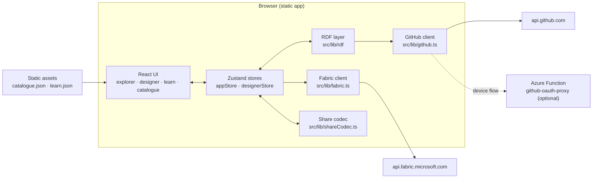
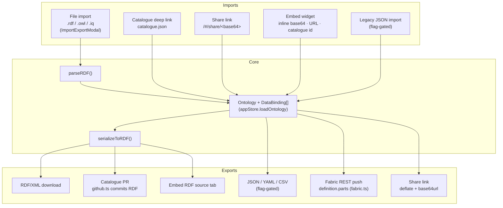
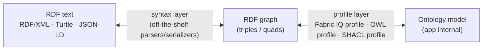

# Ontology Playground — Architecture

> A comprehensive architecture reference for contributors, with a deep dive
> into the RDF import/export layer and a design proposal for first-class
> OWL and SHACL support.
>
> Companion documents: [TODO-full-ontology-format.md](TODO-full-ontology-format.md)
> (Fabric IQ format parity roadmap), [embed-guide.md](embed-guide.md),
> [embed-security.md](embed-security.md), [github-oauth-setup.md](github-oauth-setup.md).

---

## Table of contents

1. [System overview](#1-system-overview)
2. [Repository layout](#2-repository-layout)
3. [Build, test, and deployment pipeline](#3-build-test-and-deployment-pipeline)
4. [Runtime architecture](#4-runtime-architecture)
5. [The core data model](#5-the-core-data-model)
6. [Import / export architecture](#6-import--export-architecture)
7. [The RDF layer in depth](#7-the-rdf-layer-in-depth)
8. [Validation architecture](#8-validation-architecture)
9. [Recommended changes: supporting OWL and SHACL](#9-recommended-changes-supporting-owl-and-shacl)
10. [Appendix: key file reference](#appendix-key-file-reference)

---

## 1. System overview

Ontology Playground is a **zero-backend, fully static** React 19 + TypeScript
web application (built with Vite) for learning about ontologies and Microsoft
Fabric IQ. Every feature — graph exploration, the visual designer, RDF
import/export, share links, even pushing to the Fabric REST API and opening
GitHub pull requests — runs entirely in the browser. The only server-side
code is a pair of *optional* Azure Functions (a CORS proxy for GitHub device
flow OAuth, and an optional AI ontology builder); the app degrades gracefully
without them.

Three architectural commitments shape everything else:

1. **Static-site constraint.** No database, no API server, no build-time
   secrets. All ontology processing (parsing, serialization, compression,
   validation) happens client-side; external calls go directly from the
   browser to GitHub or the Fabric API using user-supplied credentials.
2. **RDF/XML as the canonical interchange format.** The app's internal
   model is a simple TypeScript object graph, but the *file format of
   record* — for downloads, the community catalogue, and Fabric IQ
   interop — is a specific OWL-flavored RDF/XML dialect. Round-trip
   fidelity (serialize → parse → identical model) is a hard requirement
   enforced by tests and the catalogue build.
3. **Fabric IQ as the semantic ceiling.** The internal model deliberately
   mirrors what Fabric IQ ontologies can express (flat entity types, typed
   properties, binary relationships with cardinality). Anything richer —
   class hierarchies, OWL restrictions, constraint shapes — is currently
   out of scope. Section 9 proposes how to lift that ceiling.



---

## 2. Repository layout

| Path | Role | When it runs |
|------|------|--------------|
| `src/` | Application source (components, stores, libs, data) | Runtime |
| `catalogue/` | **Source of truth** for catalogue ontologies: `official/`, `community/<user>/<slug>/`, `external/<source>/<slug>/`. Each entry = one `.rdf`/`.owl` file + `metadata.json` (validated against `catalogue/metadata-schema.json`) | Build time |
| `content/learn/` | Markdown source for Ontology School courses | Build time |
| `public/` | Static assets served as-is, including the **generated** `catalogue.json` and `learn.json` (committed build outputs) | Runtime |
| `scripts/` | Build-time compilers and validators (run via `tsx`) | Build/CI |
| `api/` | Optional Azure Functions (`github-oauth-proxy`, `generate-ontology`) | Server (optional) |
| `docs/` | Contributor and authoring documentation | — |
| `data/reference/` | Reference CSV material, not shipped in the bundle | Authoring |

The important pattern: `catalogue/` and `content/` are *compiled* into JSON
artifacts in `public/` by `scripts/compile-catalogue.ts` and
`scripts/compile-learn.ts`. The app never fetches raw RDF from the
catalogue at runtime — it fetches the pre-parsed `catalogue.json`, which
contains each ontology already converted to the internal model.

---

## 3. Build, test, and deployment pipeline

`npm run build` executes the full pipeline:

```
catalogue:build (compile-catalogue.ts)   catalogue/**.rdf → public/catalogue.json
learn:build     (compile-learn.ts)       content/learn/** → public/learn.json
tsc -b                                   type-check
vite build                               main SPA → build/
build:embed     (vite.config.embed.ts)   src/embed.tsx → build/embed/ontology-embed.js (IIFE, single file)
```

- **Two Vite configs.** `vite.config.ts` builds the SPA (output `build/`,
  base path derived from `VITE_BASE_PATH` or the GitHub repository name;
  manual chunks split cytoscape and UI vendors). `vite.config.embed.ts`
  builds the self-contained embed widget as an IIFE library
  (`window.OntologyEmbed`), CSS bundled into one file, coexisting in the
  same output directory.
- **Testing.** Vitest with jsdom (`vitest.config.ts`, setup in
  `src/test/setup.ts`), Testing Library for components. RDF round-trip
  fidelity is covered by `src/lib/rdf/roundtrip.test.ts` plus
  `serializer.test.ts` / `parser.test.ts`.
- **CI** (`.github/workflows/ci.yml`): `npm ci --ignore-scripts` →
  catalogue + learn builds → `npm run validate` (RDF validation, see §8) →
  type-check → accessibility tests → unit tests → Vite build. This gates
  community catalogue PRs.
- **Deployment.** GitHub Pages (`deploy-ghpages.yml`, with `404.html` SPA
  fallback) and Azure Static Web Apps (`staticwebapp.config.json` with a
  strict CSP — `connect-src` limited to self + `github.com`/`api.github.com`).
- **PR previews.** `ontology-preview-render.yml` renders Playwright
  screenshots of changed catalogue entries and comments them on the PR
  (`scripts/list-changed-catalogue-entries.ts`,
  `scripts/render-ontology-previews.ts`).

---

## 4. Runtime architecture

### 4.1 Routing and composition

Routing is hash-based with no router library. `src/lib/router.ts` defines a
`Route` union (`home | catalogue | embed | designer | learn | share`),
`parseHash()`/`navigate()`/`onRouteChange()`, and sanitizes catalogue IDs
and share payloads (URL-safe base64, length caps, path-traversal guards).
`src/hooks/useRoute.ts` exposes this as a React hook.

`src/App.tsx` is the composition root. Full-page routes short-circuit to
`<OntologyDesigner>` or `<LearnPage>`; otherwise it renders the graph
explorer: `Header`, `QuestPanel`, the Cytoscape-powered `OntologyGraph`,
a right sidebar (stats, path finder, search, inspector, query playground),
and a stack of modals (import/export, Fabric push, gallery, command
palette, guided tour…). Deep links (`/#/catalogue/<id>`, `/#/share/<data>`)
are resolved in effects that fetch `catalogue.json` or decode the share
payload, then call `loadOntology`.

### 4.2 State management

Two independent Zustand stores, deliberately decoupled:

- **`src/store/appStore.ts`** — the *live* ontology being explored:
  `currentOntology` (defaults to the Fourth Coffee sample), `dataBindings`,
  selection/highlight state, theme (the only persisted field, via
  `localStorage`), quest/gamification state, and query state.
  `loadOntology(ontology, bindings)` is the single entry point through
  which every import surface injects an ontology; it resets selection and
  regenerates quests (`generateQuestsForOntology`).
- **`src/store/designerStore.ts`** — the designer's *draft* ontology, with
  a manual undo/redo history (deep-clone snapshots, 50-level cap), CRUD
  actions for entities/properties/relationships, and — importantly — the
  **shared validation engine** (`validateOntology`, Fabric IQ naming
  rules) that both the designer UI and CI scripts import.

### 4.3 Query engine and quests

`src/data/queryEngine.ts` is a rule-based natural-language matcher over the
in-memory ontology (not SPARQL — results are illustrative, aimed at
teaching what an ontology-backed NL query layer does).
`src/data/questGenerator.ts` derives guided quests from any loaded
ontology's structure; `questQueryValidator.ts` verifies generated
query-quests actually resolve against the query engine (backed by
`questIntegrity.test.ts`).

---

## 5. The core data model

Everything pivots on the `Ontology` interface in `src/data/ontology.ts`:

```ts
interface Ontology {
  name: string;
  description: string;
  entityTypes: EntityType[];      // id, name, description, icon, color, properties[]
  relationships: Relationship[];  // id, name, from, to, cardinality, attributes?[]
}

interface Property {
  name: string;
  type: 'string' | 'integer' | 'decimal' | 'double' | 'date'
      | 'datetime' | 'boolean' | 'enum';
  isIdentifier?: boolean;
  unit?: string;
  values?: string[];              // enum values
  description?: string;
}
```

Supporting types: `RelationshipAttribute` (typed attributes on a
relationship), `EntityInstance` (sample instance data), and `DataBinding`
(entity → lakehouse table/column mappings, mirroring Fabric IQ's data
binding concept).

Key characteristics that matter for the RDF discussion:

- **Flat class space.** No entity-type inheritance, no abstract types.
- **Binary, named relationships** with one of four cardinalities
  (`one-to-one`, `one-to-many`, `many-to-one`, `many-to-many`).
- **Closed property type set** aligned to Fabric IQ value types, plus
  presentation metadata (`icon`, `color`) that has no standard RDF home.
- **IDs are app-local strings** (`customer`, `customer_places_order`), not
  IRIs. IRIs are *derived* at export time and *collapsed back* to local
  IDs at import time — a central source of round-trip lossiness for
  foreign files (see §7.4).

---

## 6. Import / export architecture

The app has an unusually large number of import/export surfaces, but they
all funnel through the same narrow waist: **the `Ontology` object and the
`src/lib/rdf` codec**.



### 6.1 Surface-by-surface summary

| Surface | Direction | Format | Code path |
|---------|-----------|--------|-----------|
| Import/Export modal | in/out | RDF/XML (`.rdf`, `.owl`, `.iq`); legacy JSON/YAML/CSV behind `VITE_ENABLE_LEGACY_FORMATS` | `src/components/ImportExportModal.tsx` → `parseRDF`/`serializeToRDF` |
| Catalogue | in | Pre-parsed JSON (`public/catalogue.json`, compiled from RDF at build time) | `App.tsx` / `GalleryModal.tsx` fetch + `loadOntology` |
| Catalogue contribution | out | RDF/XML + `metadata.json` committed via GitHub API (fork → branch → PR) | `src/lib/github.ts` (`submitToCatalogue`); designer's `SubmitCatalogueModal` currently offers manual download |
| Share links | in/out | Internal JSON, `CompressionStream('deflate')`, base64url in the URL hash (≤32 000 chars) | `src/lib/shareCodec.ts` |
| Fabric push | out | Fabric `definition.parts` — base64-encoded JSON parts (`.platform`, `EntityTypes/<id>/definition.json`, …) pushed to `api.fabric.microsoft.com/v1` | `src/lib/fabric.ts` (`convertToFabricParts`, `createOntology`, `updateOntologyDefinition`) |
| Embed widget | in/out | Inline base64 JSON, remote URL (RDF or JSON auto-detected), or catalogue ID; renders an RDF source tab via `serializeToRDF` + `highlightRdf` | `src/embed.tsx`, `src/components/EmbedWidget.tsx` |
| AI builder (optional) | in | JSON from Azure OpenAI, schema-validated server-side | `api/generate-ontology/`, `NLBuilderModal.tsx` |

Two observations worth making explicit:

- **RDF/XML is the only *interchange* format; JSON is the only *internal*
  format.** Share links, the catalogue JSON, and embeds all move the
  internal JSON model around; RDF is produced/consumed only at the
  file-format boundary. This means the RDF codec is the single point where
  standards compliance is won or lost.
- **The Fabric push path bypasses RDF entirely.** `convertToFabricParts`
  maps the internal model straight to Fabric's JSON parts format. RDF and
  Fabric are sibling projections of the same model, not layered on each
  other.

---

## 7. The RDF layer in depth

The codec lives in `src/lib/rdf/`:

| File | Exports | Role |
|------|---------|------|
| `serializer.ts` | `serializeToRDF`, `escapeXml`, `deriveBaseUri` | Model → RDF/XML via direct string concatenation |
| `parser.ts` | `parseRDF`, `RDFParseError` | RDF/XML → model via browser `DOMParser` (jsdom in build scripts) |
| `highlighter.ts` | `highlightRdf`, theme palettes | Regex-based syntax highlighting for source views (not in the barrel) |
| `index.ts` | Barrel for serializer + parser | Public API |

### 7.1 The export dialect

`serializeToRDF(ontology, bindings)` emits an OWL-flavored RDF/XML document:

- A base IRI is derived from the ontology name:
  `http://example.org/ontology/<slug>/` (`deriveBaseUri`).
- An `owl:Ontology` header carries `rdfs:label`/`rdfs:comment`.
- Each `EntityType` becomes an `owl:Class` named by *capitalizing the
  app-local ID* (`customer` → `<base>Customer`).
- Each property becomes an `owl:DatatypeProperty` named
  `<entityId>_<propName>`, with `rdfs:domain`, an XSD `rdfs:range`
  (via `XSD_TYPE_MAP`), and `rdfs:label`.
- Each relationship becomes an `owl:ObjectProperty` with
  `rdfs:domain`/`rdfs:range` pointing at the class IRIs.
- **Everything the standard vocabularies can't express is written as
  custom annotations in the ontology's own namespace** (`xmlns:ont` =
  the base IRI): `ont:icon`, `ont:color`, `ont:isIdentifier`, `ont:unit`,
  `ont:enumValues` (comma-joined), `ont:propertyType` (round-trip hint),
  `ont:cardinality`, `ont:fromEntityId` / `ont:toEntityId`, and
  relationship attributes as extra datatype properties tagged
  `ont:relationshipAttributeOf`. Data bindings serialize as
  `ont:DataBinding` resources with `ont:source` / `ont:table` /
  `ont:columnMapping` (`prop=column` strings).

The output is *syntactically* valid RDF/XML, and it is the exact format
Microsoft Fabric IQ import expects — that alignment is the dialect's
reason for existing.

### 7.2 The import path

`parseRDF(rdfXml)` uses `DOMParser` (`application/xml`) and walks the DOM:

- `owl:Class` elements → entity types. The entity ID is recovered by
  taking the IRI's local name and *uncapitalizing* it. `ont:icon`/`ont:color`
  fall back to defaults (`📦`, `#0078D4`).
- `owl:DatatypeProperty` elements → properties, matched to their entity
  **by exact domain-IRI lookup**. Property type resolution prefers the
  `ont:propertyType` hint, falls back to mapping the XSD range
  (`XSD_TO_TYPE` handles `int`/`long`/`float` variants), and defaults to
  `string`. Elements carrying `ont:relationshipAttributeOf` are diverted
  into relationship attributes instead.
- `owl:ObjectProperty` elements → relationships. Endpoints prefer the
  `ont:fromEntityId`/`ont:toEntityId` hints, falling back to
  uncapitalized domain/range local names. Unknown cardinality strings
  default to `one-to-many`; relationships with unresolvable endpoints
  are silently dropped.
- `ont:DataBinding` elements (matched by local name) → `DataBinding[]`.
- Child lookup is deliberately forgiving: namespace-aware first, then a
  local-name scan — so files with unconventional prefixes still parse.

### 7.3 The round-trip contract and where it's enforced

Round-trip fidelity (`parseRDF(serializeToRDF(o))` deep-equals `o`) is a
hard invariant, enforced in three places:

1. `src/lib/rdf/roundtrip.test.ts` — structural equality for the built-in
   sample ontologies.
2. `scripts/compile-catalogue.ts` — every catalogue entry is parsed,
   re-serialized, and re-parsed at build time; divergence fails the build
   (and therefore community PRs).
3. `scripts/validate-rdf.ts` (`npm run validate`, run in CI) — semantic
   validation of all official + community RDF files.

Note that the contract is **model-centric, not graph-centric**: it
guarantees the *internal model* survives a round trip through the dialect.
It does **not** guarantee that a foreign RDF file survives — anything the
model can't represent is dropped on import and therefore absent on
re-export.

### 7.4 Current limitations (the honest list)

These are the gaps that motivate Section 9:

- **One serialization, hand-rolled.** Only RDF/XML is read or written, via
  string concatenation and DOM walking. Turtle, JSON-LD, and N-Triples —
  the formats most real-world ontologies circulate in — are unsupported,
  and RDF/XML's many legal syntactic variants (property attributes,
  `rdf:ID`, nested typed nodes, `rdf:parseType`) are only handled to the
  extent the DOM-walking heuristics happen to cover them.
- **No graph abstraction.** There is no triple/quad model in the codebase;
  the parser maps XML elements straight to the app model. Any triple that
  doesn't match a recognized element pattern is silently discarded — there
  is no "unknown triples" preservation, no import report.
- **OWL is a costume, not a semantics.** The exporter borrows OWL class
  and property vocabulary, but expresses cardinality, enums, identifiers,
  and units as proprietary `ont:` annotations rather than OWL restrictions
  or standard constructs. Conversely, the parser ignores `rdfs:subClassOf`,
  `owl:Restriction`, `owl:inverseOf`, `owl:FunctionalProperty`,
  `owl:imports`, blank nodes, and unions — a Protégé- or FIBO-style
  ontology imports as a flat list of classes with whatever datatype
  properties happen to have exact-match domains.
- **Lossy naming.** IRIs are collapsed to local names and case-mangled
  (capitalize/uncapitalize), so imported entities lose their original
  namespaces; two classes with the same local name in different namespaces
  collide. The `<entityId>_<propName>` convention leaks the app's internal
  ID scheme into exported IRIs.
- **No validation semantics.** Constraints (identifier presence, name
  rules, type uniqueness) live in TypeScript (`designerStore.validateOntology`)
  and are invisible in the exported artifact — a consumer of the RDF has
  no machine-readable statement of the constraints the Playground enforced.

---

## 8. Validation architecture

Validation is split across three layers, all sharing one engine:

1. **Interactive** — `validateOntology()` in `src/store/designerStore.ts`
   runs on every designer mutation: structural checks plus Fabric IQ rules
   (1–26 char alphanumeric names, identifier required and string/integer,
   cross-entity property name/type uniqueness).
2. **Build-time** — `scripts/compile-catalogue.ts` re-runs the same
   validation, plus round-trip verification and `scripts/style-validator.ts`
   (label casing conventions, typo detection) on every catalogue entry.
3. **CI** — `scripts/validate-rdf.ts` gates PRs by validating built-in
   ontologies and all official/community RDF files.

This is a strength worth preserving: one validation engine, three
enforcement points. The SHACL proposal in §9.4 builds on exactly this
pattern — it makes the *engine* standards-based rather than adding a
parallel one.

---

## 9. Recommended changes: supporting OWL and SHACL

This section is a **high-level design direction**, not an implementation
plan. It covers three OWL goals (import real-world files, model richer
semantics, export standards-compliant OWL) and three SHACL goals (generate
shapes on export, import shapes, validate instance data), and how to reach
them without breaking the project's constraints.

### 9.0 Guiding principles

1. **Stay zero-backend.** Everything proposed here is achievable
   client-side; mature RDF and SHACL tooling exists as pure-browser
   JavaScript (e.g. the RDF/JS ecosystem — N3-style parsers, dataset
   implementations, SHACL engines). Library choice is deferred, but the
   constraint is: browser-capable, tree-shakeable, and acceptable in a
   lazily loaded chunk.
2. **Don't break the Fabric IQ contract.** The current dialect is what
   Fabric IQ consumes and what 100+ catalogue entries are written in. It
   should become one **named profile** among several, not be mutated in
   place. Round-trip tests for the existing dialect keep passing untouched.
3. **Keep the narrow waist, upgrade its foundation.** All import/export
   surfaces already funnel through `src/lib/rdf` and `loadOntology`. That
   shape is right. The change is *inside* the waist: replace direct
   XML↔model mapping with a real RDF graph as the intermediate
   representation.
4. **Lossless by default, lossy by choice.** The single biggest
   architectural fix is to stop silently discarding what the model can't
   represent. Imports should preserve unknown statements and report what
   was mapped, kept, or dropped.

### 9.1 Foundation: a graph-based RDF core

**Current:** `RDF/XML text ⇄ Ontology object`, one hand-rolled codec.

**Proposed:** introduce an RDF *graph* (a set of triples/quads, per the
RDF/JS data model) as the intermediate representation, and split the codec
into two independent layers:



- The **syntax layer** is bought, not built: standards-tested parsers and
  serializers for RDF/XML, Turtle, and JSON-LD. This alone fixes the
  "RDF/XML syntactic variants" fragility and adds multi-format import
  for free (Turtle being the most requested format for real-world OWL).
- The **profile layer** is where this project's actual intelligence lives:
  mappings between the graph and the app model. The existing dialect
  becomes the *Fabric IQ profile* (graph patterns equivalent to today's
  output, guaranteeing byte-level-compatible RDF/XML for Fabric and the
  catalogue). New profiles (§9.2–9.4) are added beside it.
- **Residual graph.** When a profile maps a graph to the model, statements
  it doesn't understand go into a retained "residual" attached to the
  loaded ontology (an opaque set of quads, carried through the store but
  never edited). On export, the residual is merged back in. This is what
  makes importing a real Protégé ontology, editing the parts the
  Playground understands, and re-exporting *non-destructive* — and it can
  be introduced incrementally (start by just counting and reporting
  dropped statements; graduate to preserving them).

Trade-offs to accept consciously: bundle size (mitigated by lazy-loading
the RDF chunk — imports/exports are modal interactions, never on the
critical render path), and a second representation to keep in sync
(mitigated by the fact that the graph is *transient* — the app model
remains the single source of truth for the UI, exactly as today).

### 9.2 OWL: importing real-world ontologies

With the graph core in place, an **OWL import profile** maps standard
constructs onto the (extended) model instead of requiring `ont:` hints:

| OWL construct | Mapping |
|---------------|---------|
| `owl:Class` / `rdfs:Class` declarations, incl. Turtle/JSON-LD sources | Entity types; keep the full IRI (see §9.3) |
| `rdfs:subClassOf` (named classes) | Entity-type hierarchy (new model field) |
| `owl:ObjectProperty` with named domain/range | Relationships |
| `owl:Restriction` cardinalities (`owl:maxCardinality`, `owl:someValuesFrom`, qualified forms), `owl:FunctionalProperty` | Best-effort collapse to the four cardinality values |
| `owl:DatatypeProperty` ranges | Property types via XSD mapping (already partially exists) |
| `rdfs:label` / `rdfs:comment` / `skos:*` / `dcterms:*` annotations | Names and descriptions, with language-tag preference |
| `owl:imports` | Explicitly *not* auto-resolved (network + CSP); surface as an informational notice |
| Everything else (unions, complements, property chains, individuals…) | Residual graph + import report |

The key new UX artifact is the **import report**: "mapped 34 classes, 51
properties; approximated 6 restrictions as cardinalities; preserved 412
statements the Playground can't display." This converts silent data loss
into informed consent, and doubles as a teaching moment consistent with the
app's educational mission.

### 9.3 OWL: richer internal model and standards-compliant export

Model extensions should be **optional fields with defaults**, so existing
catalogue entries, share links, quests, and the designer keep working:

- `parent?: string` on `EntityType` (single inheritance is enough for the
  visualization and Fabric IQ's `baseEntityTypeId`; multiple inheritance
  stays in the residual).
- `iri?: string` on entity types, properties, and relationships,
  preserving original namespaces for imported ontologies; app-local IDs
  remain the internal keys. A configurable base IRI on the `Ontology`
  replaces the hard-coded `example.org` derivation.
- Optional relationship traits that OWL can express and Fabric IQ can
  partially consume: `inverseOf`, functional/inverse-functional flags.

On export, offer **two named profiles** (a dropdown where "RDF" sits today):

1. **Fabric IQ profile** — today's dialect, unchanged, remains the default
   and the catalogue format.
2. **Standard OWL profile** — cardinalities as `owl:Restriction` blocks
   instead of `ont:cardinality`; enums as `owl:DataOneOf`; identifiers as
   `owl:hasKey`; hierarchy as `rdfs:subClassOf`; presentation metadata
   (`icon`, `color`) as a *documented, fixed-namespace annotation
   vocabulary* (not the per-ontology `ont:` namespace, which currently
   makes every export's annotations live in a different namespace);
   serialization choice of RDF/XML or Turtle. Target: loads cleanly in
   Protégé and passes an OWL validator.

The designer UI grows modestly (a "parent type" selector, an ontology
IRI field); everything else is exporter/importer work. The graph
visualization gets `subClassOf` edges rendered distinctly — a genuine
pedagogical win, since inheritance is the most-asked-about gap between
this tool and real ontology editors.

### 9.4 SHACL: generation, import, and validation

SHACL fits this codebase unusually well because the Playground *already
has* a constraint engine (§8) — it's just written in TypeScript and
invisible in exports. The direction: make SHACL the standards-based
expression of those same constraints.

**Generate shapes on export.** A deterministic projection of the model —
no new user input required:

| Model concept | SHACL |
|---------------|-------|
| `EntityType` | `sh:NodeShape` + `sh:targetClass` |
| `Property` (typed) | `sh:property` with `sh:datatype`, `sh:name`, `sh:description` |
| `isIdentifier` / key | `sh:minCount 1`, `sh:maxCount 1` (+ uniqueness note) |
| `enum` values | `sh:in` list |
| Relationship + cardinality | `sh:property` with `sh:class` and `sh:minCount`/`sh:maxCount` pairs on both ends |
| Fabric IQ name rules | `sh:pattern` / `sh:maxLength` on name-bearing paths |

Ship it as a third export profile ("SHACL shapes", Turtle), either
standalone or bundled with the OWL export. This is the cheapest of the six
goals and the natural first SHACL milestone.

**Import shapes.** The inverse mapping: `sh:NodeShape` + `sh:targetClass`
→ entity types, `sh:property` constraints → typed properties and
relationship cardinalities. Two modes matter: shapes-only files (common in
data-engineering contexts — the shapes *are* the schema) and OWL + SHACL
combined files (merge: OWL supplies the class/property skeleton, SHACL
refines types and cardinalities). Unmappable constraint kinds (`sh:sparql`,
logical combinators) follow the residual-plus-report pattern from §9.2.

**Validate data with SHACL.** Run a browser-capable SHACL engine over
instance data against the generated (or imported) shapes:

- *In-app:* the Playground already has `EntityInstance[]` sample data and
  an instance-view ambition ([TODO §11](TODO-full-ontology-format.md)).
  A "Validate" panel that converts instances to RDF, runs the shapes, and
  renders the standard `sh:ValidationReport` (severity, focus node,
  path, message) would let learners *see* constraint violations — arguably
  the best possible way to teach what SHACL is for.
- *In CI:* `scripts/validate-rdf.ts` gains a SHACL pass over catalogue
  entries, so community contributions are checked by the same
  standards-based engine users see in the app. Over time, hand-written
  TypeScript checks that SHACL can express migrate into shapes; checks it
  can't (cross-entity type uniqueness, typo detection) stay in TypeScript.

### 9.5 Sequencing and risk

A dependency-ordered path (each stage independently shippable):

1. **Graph core + syntax layer** — re-implement the existing dialect as
   the Fabric IQ profile over a real graph; existing round-trip tests are
   the acceptance gate. Pure refactor, no user-visible change except
   Turtle import "for free".
2. **SHACL shape generation** — cheapest new capability, no model changes.
3. **OWL import profile + import report** — real-world file support;
   residual preservation can start as report-only.
4. **Model extensions (hierarchy, IRIs) + standard OWL export profile.**
5. **SHACL import and in-app validation** — depends on 1–2; in-app
   validation pairs naturally with the planned instance-graph work.

Principal risks:

- **Bundle growth** — RDF/SHACL libraries are non-trivial; keep them in a
  lazily loaded chunk (the Vite config already does manual chunking) and
  out of the embed widget build, which should keep its current minimal
  codec.
- **Semantic mismatch** — OWL restrictions are open-world logic; the
  Playground's cardinalities and SHACL are closed-world constraints.
  Collapsing restrictions to four cardinality values is an approximation
  and must be labeled as such in the import report, not presented as
  equivalence.
- **Catalogue stability** — the Fabric IQ profile must stay byte-stable;
  golden-file tests over existing catalogue entries are the cheap
  insurance.
- **Scope creep vs. mission** — this is a learning tool, not a Protégé
  replacement. The residual-graph pattern is the pressure valve: the
  Playground never needs to *understand* all of OWL to be *non-destructive*
  toward it.

---

## Appendix: key file reference

| Area | Files |
|------|-------|
| Core model | `src/data/ontology.ts`, `src/data/sampleOntologies.ts` |
| RDF codec | `src/lib/rdf/serializer.ts`, `src/lib/rdf/parser.ts`, `src/lib/rdf/highlighter.ts`, `src/lib/rdf/index.ts` |
| Round-trip tests | `src/lib/rdf/roundtrip.test.ts`, `serializer.test.ts`, `parser.test.ts` |
| Import/export UI | `src/components/ImportExportModal.tsx`, `src/components/FabricExportModal.tsx`, `src/components/designer/SubmitCatalogueModal.tsx` |
| Fabric client | `src/lib/fabric.ts` |
| GitHub / catalogue PR | `src/lib/github.ts`, `api/github-oauth-proxy/` |
| Share links | `src/lib/shareCodec.ts` |
| Embed widget | `src/embed.tsx`, `src/components/EmbedWidget.tsx`, `vite.config.embed.ts` |
| State | `src/store/appStore.ts`, `src/store/designerStore.ts` |
| Routing | `src/lib/router.ts`, `src/hooks/useRoute.ts`, `src/App.tsx` |
| Catalogue pipeline | `catalogue/`, `scripts/compile-catalogue.ts`, `src/types/catalogue.ts` |
| Validation | `src/store/designerStore.ts` (`validateOntology`), `scripts/validate-rdf.ts`, `scripts/style-validator.ts` |
| Learn pipeline | `content/learn/`, `scripts/compile-learn.ts`, `src/components/LearnPage.tsx` |
| Query / quests | `src/data/queryEngine.ts`, `src/data/questGenerator.ts`, `src/data/questQueryValidator.ts` |
| CI / deploy | `.github/workflows/ci.yml`, `deploy-ghpages.yml`, `staticwebapp.config.json` |
